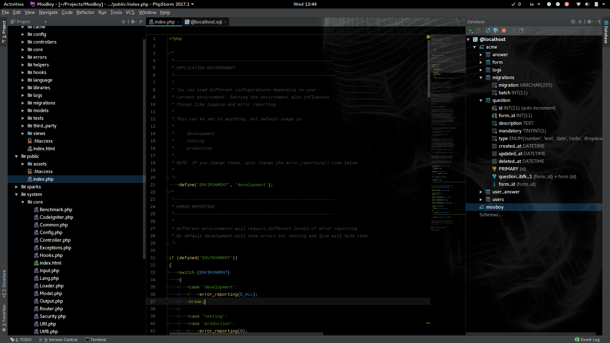

# DarkKnight
DarkKnight settings for IntelliJ

Featuring: the Midnight Devil theme for the editor and Afterglow for the project window, plus Codeglance for a bit of sublime look and feel.

Very visible error marks.

Installation:

- BACKUP YOUR SETTINGS! Very important in case you don't like my settings.
- Download the latest version.
- Import settings.
- Instal ColorIde plugin manually
- Restart IntelliJ

Main Shortcuts (unmark keymap if you don't want it).

1. Ctrl+W - Closes active editor tab!!!
2. Ctrl+Shift+T = Reopen last open tab!!!
3. Ctrl+Tab && Ctrl+Shift+Tab = Navigate on editor tabs!!!
4. Ctrl+Shift+C = Comment lines
5. Ctrl+F = Find/Replace
6. Ctrl+D = Delete line
7. Ctrl+Shift+F = Reformat code
8. Ctrl+Alt+F = F ormat code

